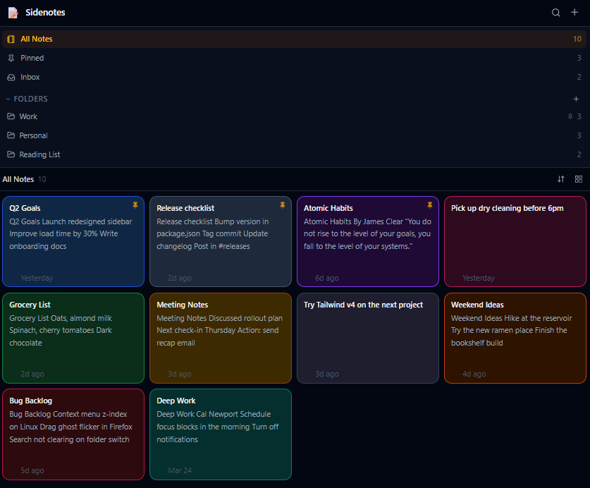

# Sidenotes V2

A polished sticky-notes app that lives inside the **Opera browser sidebar**. Fast, clean, and pleasant to use — right next to the content you're browsing.



---

## Features

### Note Management
- **Create, edit, delete** notes with instant auto-save
- **Pin notes** globally or within a folder context
- **Duplicate** notes with one click
- **Color-code** notes with 10 built-in color themes
- **Search** across all note titles and content
- **Sort** by last modified, date created, title, or color

### Folder System
- **Create and rename folders** to organize notes
- **Delete folders** (notes move to Inbox automatically)
- **Pin folders** to keep them at the top of the list
- **Move notes** between folders via context menu or note editor
- **Inbox view** — notes not assigned to any folder
- **Pinned view** — all pinned notes across all folders
- **All Notes view** — everything in one place

### UX
- Sticky-notes inspired design with color-coded cards
- 2-column grid or list layout (togglable)
- Right-click context menu on any note card
- Full keyboard shortcut support
- Auto-save with visual feedback
- Smooth transitions and micro-animations
- Dark mode support (follows OS preference)
- Accessible HTML structure and ARIA labels
- Optimized for Opera sidebar (~320–400px width)

---

## Tech Stack

| Layer | Technology |
|---|---|
| Framework | React 18 + TypeScript |
| Styling | Tailwind CSS v3 |
| State | Zustand v5 |
| Build | Vite 5 |
| Icons | Lucide React |
| Storage | `chrome.storage.local` (Opera extension) / `localStorage` (dev fallback) |

---

## Architecture

```
src/
├── types/
│   └── index.ts          # Domain types, NoteColor definitions, StorageData
├── storage/
│   └── storage.ts        # chrome.storage.local adapter with localStorage fallback
├── store/
│   └── store.ts          # Zustand store — all state, actions, auto-save
├── utils/
│   └── helpers.ts        # Pure utilities: filtering, sorting, dates, debounce
├── components/
│   ├── ui/               # Generic UI primitives (Button, Modal)
│   ├── AppHeader.tsx     # Top bar: title, search toggle, new note button
│   ├── FolderNav.tsx     # Navigation panel: views (All/Pinned/Inbox) + folders
│   ├── SortMenu.tsx      # Notes toolbar: sort dropdown, layout toggle, count
│   ├── NotesGrid.tsx     # Note list/grid with sorting/filtering applied
│   ├── NoteCard.tsx      # Individual note card (grid or list variant)
│   ├── NoteEditor.tsx    # Full-panel note editing overlay
│   ├── ColorPicker.tsx   # Color selection popover
│   ├── ContextMenu.tsx   # Right-click context menu (pin/duplicate/move/delete)
│   ├── FolderModal.tsx   # Create / rename folder dialog
│   └── EmptyState.tsx    # Empty state for no notes / no search results
├── App.tsx               # Root component, keyboard shortcuts, loading state
├── main.tsx              # React entry point
└── index.css             # Tailwind base + custom scrollbar + resets
```

### Data Flow

```
User action
    │
    ▼
Zustand store action
    │
    ├─→ State update (synchronous, immediate UI update)
    │
    └─→ debouncedSave (800ms debounce)
            │
            ▼
        storageService.save()
            │
            ├─→ chrome.storage.local  (in Opera extension)
            └─→ localStorage          (in development)
```

All data lives in a single JSON blob stored under the key `sidenotes_v2_data`. This keeps the storage simple, atomic, and easy to export/import.

---

## Persistence — How It Works

### In Opera (as an extension)

Data is saved to `chrome.storage.local`:

- **Quota**: 10 MB — more than enough for thousands of notes
- **Persistence**: Survives browser restarts and updates
- **Scope**: Local to the device and browser profile

### Cross-Device Sync Limitation

> **Important**: Opera does **not** sync `chrome.storage.sync` via Opera accounts across devices. This is a confirmed platform limitation — unlike Chrome, Opera does not implement the sync mechanism for extension storage.

As a result, your notes are **local-only** by default. If you want cross-device access, the options are:

1. **Manual export/import** (a future feature — see roadmap)
2. **Custom backend sync** — the storage layer is designed to be swapped out; you could implement a sync adapter backed by a REST API, Firebase, etc.

The storage layer (`src/storage/storage.ts`) is intentionally thin and replaceable for this reason.

### In Development

When running `npm run dev` outside of an extension context, the app automatically falls back to `localStorage`. This means you can develop and test the app normally in any browser.

---

## Opera-Specific Notes

- The extension uses `sidebar_action` in the manifest — an Opera-specific key (not the same as Chrome's `side_panel` API)
- The sidebar panel is loaded from `sidebar.html`
- The extension requires only the `"storage"` permission, which does **not** trigger a user consent warning during installation
- No background service worker is needed for this extension
- The sidebar does not expose a resize/width callback API; the UI is designed to be responsive within the typical 300–400px sidebar width range
- Manifest V3 is used, which Opera supports

---

## Development Setup

### Prerequisites

- Node.js v18+
- npm v9+

### Install

```bash
git clone https://github.com/YOUR_USERNAME/sidenotes-v2.git
cd sidenotes-v2
npm install
```

### Generate Icons

Before building (or running for the first time), generate the PNG extension icons from the SVG source:

```bash
npm run generate:icons
```

This requires `sharp` (installed as a devDependency). It outputs `public/icons/icon16.png`, `icon48.png`, and `icon128.png`.

### Run in Development Mode

```bash
npm run dev
```

Opens `http://localhost:5173/sidebar.html` in your browser. The app works as a regular web page with `localStorage` as the storage backend — no extension context needed for development.

### Type Check

```bash
npm run typecheck
```

---

## Build

```bash
npm run build
```

Output goes to `dist/`. This runs icon generation, TypeScript type-checking, and Vite's production build.

To build without generating icons (e.g., if icons are already generated):

```bash
npm run build:noicons
```

---

## Loading the Extension in Opera

1. Run `npm run build` to generate the `dist/` folder
2. Open Opera and navigate to `opera://extensions`
3. Enable **Developer mode** (toggle in top right)
4. Click **Load unpacked**
5. Select the `dist/` folder
6. The extension should appear in your extensions list
7. Click the Sidenotes icon in the sidebar (or enable it via the sidebar settings)

### Updating After Code Changes

After making changes:
```bash
npm run build
```
Then in Opera, go to `opera://extensions` and click the **Reload** button on the Sidenotes V2 card.

---

## Keyboard Shortcuts

| Shortcut | Action |
|---|---|
| `Ctrl+N` | Create a new note |
| `Ctrl+F` | Open / close search |
| `Esc` | Close note editor / clear search |
| `Enter` | Open focused note card |
| Right-click | Open context menu on a note card |

---

## Roadmap / Possible Future Improvements

- [ ] Export/import notes as JSON or Markdown
- [ ] Tags in addition to folders
- [ ] Note character/word count
- [ ] Markdown rendering in note preview
- [ ] Drag-and-drop reordering of notes and folders
- [ ] Sync via a custom backend (Supabase, Firebase, etc.)
- [ ] Note history / undo
- [ ] Resizable sidebar support when Opera exposes the API
- [ ] Bulk note operations (select multiple, move, delete)
- [ ] Note templates
- [ ] Attachments / inline images

---

## Contributing

See [CONTRIBUTING.md](CONTRIBUTING.md).

---

## License

MIT — see [LICENSE](LICENSE).
